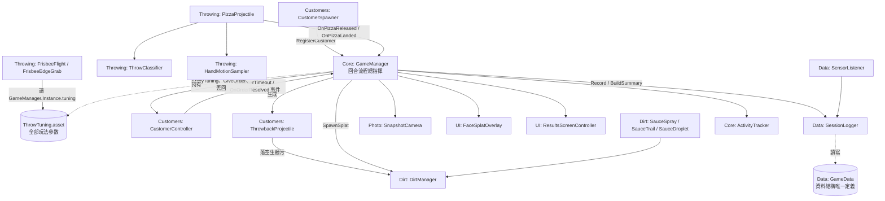

# Pizzala — 目前進度與系統架構（ARCHITECTURE.md）

> 新組員（和你的 AI）進場先讀這份：上半部是全案進度，下半部是系統怎麼串起來。
> 進度總覽由 Kendell 在**每次合併後**更新；模組間介面有變動時，改動的人順手更新對應段落。

---

## 目前進度總覽（2026-07-16）

| 模組 | 狀態 | 現況一句話 |
|---|---|---|
| 丟擲系統 Throwing | ✅ 可玩 | 飛盤式丟披薩（抓邊緣、空氣力學、手勢分類）完成，三口味披薩 Prefab 齊全，參數集中在 ThrowTuning |
| 客人系統 Customers | ✅ 可玩 | 動態生成（槽位制）＋三段情緒加速＋訂單超時丟回，2026-07-15 移植完成；UncleB／士兵兩套角色 Prefab 已建 |
| 醬料髒污 Dirt | 🔧 進行中 | 命中噴濺（decal＋角色染色）與飛行滴落可用；**貼圖懸浮問題待改善**——希望更像液體潑灑在地面（見 [Problem.md](Problem.md) 第 2 點） |
| UI／拍照 | ✅ 基本完成 | 結算畫面、髒臉照片、玩家視野糊醬完成；新的 UI 美術圖（開始／暫停／評分等）剛進來待接上 |
| 數據紀錄 Data | ✅ 完成 | 整場數據存 JSON（SessionLogger）、ESP32 感測經 UDP 接入（SensorListener） |
| 場景整合 | ✅ 同步 | 主場景 `Assets/Scenes/BackBone.unity` 已同步最新的客人／披薩／醬料／XR 設定（只有 Kendell 動） |

## 遊戲循環（一頁看懂）

一回合的流程，括號內是負責的腳本：

1. **回合開始**：`GameManager.BeginRound()` 重置髒污計數、開始記錄（`SessionLogger`、`ActivityTracker`）。
2. **客人生成**：`CustomerSpawner`（槽位制：左／中／右扇區 × 距離層）動態生成客人，經 `GameManager.RegisterCustomer` 進訂單池並推入 ThrowTuning 的移動參數。
3. **點餐與等待**：`GameManager` 派發訂單，`CustomerController` 狀態機跑「等餐 → 不耐煩 → 暴躁」，等越久遊走越快。
4. **玩家丟披薩**：`PizzaSpawner` 補貨 → 玩家用 XR 抓取（`FrisbeeEdgeGrab` 抓邊緣）→ 放手瞬間 `PizzaProjectile` 呼叫 `GameManager.OnPizzaReleased`，用 `HandMotionSampler` 的軌跡經 `ThrowClassifier` 分類手勢；飛行中 `FrisbeeFlight` 給空氣力學、`SauceSpray` 灑液滴。
5. **落地判定**：`PizzaProjectile` 碰撞 → `GameManager.OnPizzaLanded` 依 `CustomerHitZone` 判定結果（接到手／口味錯／砸臉／砸身／砸環境），砸臉觸發 `SnapshotCamera` 拍髒臉照，未接到的經 `DirtManager` 生成髒污。
6. **客人反擊**：訂單超時 → `GameManager.TryThrowback` 生成 `ThrowbackProjectile` 丟回玩家；砸中玩家頭（`PlayerHeadHitbox`）觸發 `FaceSplatOverlay` 視野糊醬，閃過則記錄閃避方向。
7. **回合結算**：`GameManager.EndRound()` → `SessionLogger` 算統計、存 JSON、`ResultsScreenController.Show()` 顯示結算（含照片牆 `PZ_PhotoEntry`）。

## 模組相依關係

文字版重點：

- **`GameManager` 是中樞**（singleton）：持有 `ThrowTuning` 資產、客人清單、各 UI／紀錄元件的引用。丟擲、客人、醬料模組都只跟它對話，彼此不直接引用。
- **共用資產兩個**：`Assets/Settings/ThrowTuning.asset`（所有玩法參數，各模組經 `GameManager.Instance.tuning` 讀取，改欄位要同步 [PARAMETERS.md](PARAMETERS.md)）和 `GameData.cs`（所有 enum／資料結構的唯一定義處，如 `PizzaFlavor`、`ThrowRecord`）。**動這兩個等於動全模組，先在群組講。**
- **singleton 有三個**：`GameManager.Instance`、`DirtManager.Instance`、`SessionLogger.Instance`。
- **事件流**：客人對 GameManager 用 C# event（`OnOrderTimeout`、`OnOrderResolved`）；其餘是直接方法呼叫。
- `Assets/Scripts/DevTools/` 的兩支 TestTrigger 是可獨立測試客人點餐／丟回的開發工具，不進正式流程。

## 規劃中／未實作（與現況區隔）

- **醬料液體化**：現在是平面 decal 貼在撞擊點，貼在人身上或斜面會懸浮；目標是像液體潑灑到地面（[Problem.md](Problem.md) 第 2 點）。
- **新 UI 美術接線**：開始／暫停／回首頁／評分等 UI 圖已交付，尚未做成可互動的 UI 流程。
- 其他新發現的問題記在 [Problem.md](Problem.md)，要動工就照 [WORKFLOW.md](WORKFLOW.md) 開功能分支。

---

## 更新紀錄

- 2026-07-16：建立文件（進度總覽、遊戲循環、模組相依、規劃中項目）。
